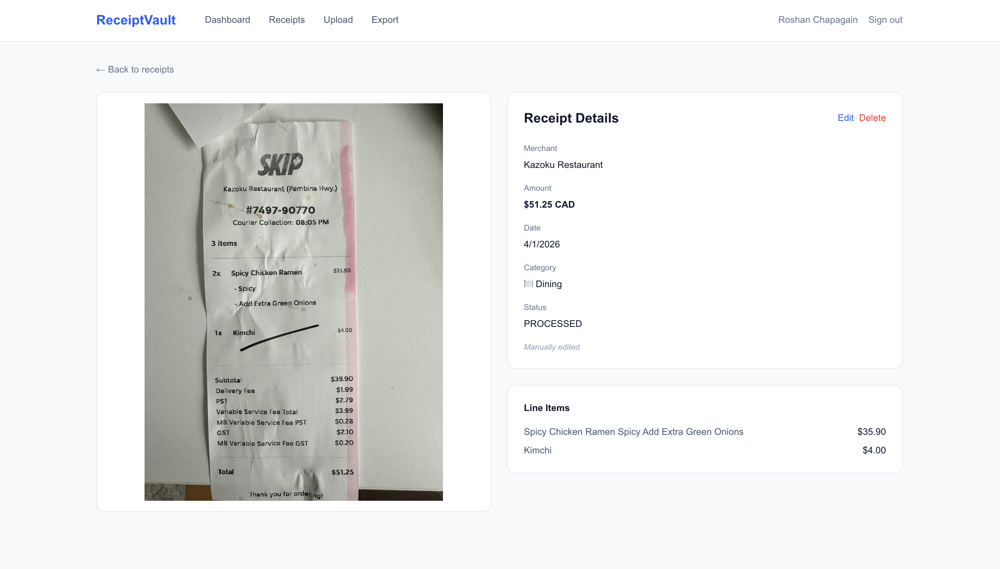
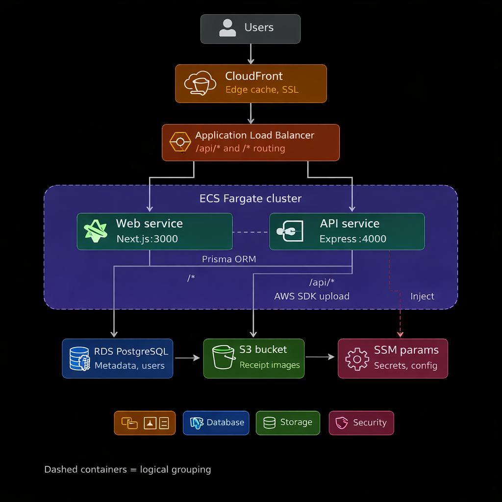
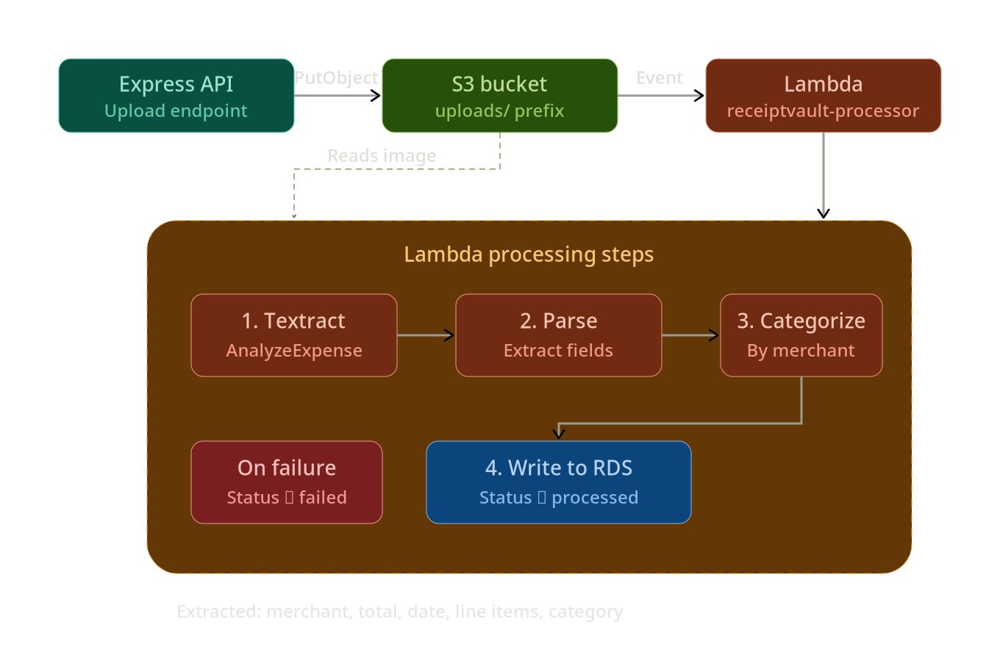
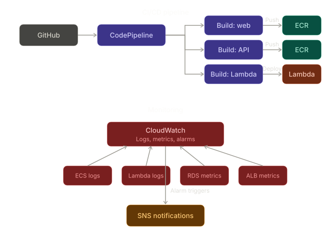

# ReceiptVault

A cloud-native smart receipt management system. Upload receipt photos, get them automatically processed with AWS Textract OCR, and track your spending through a clean dashboard with search, filtering, and CSV export.



---

## Table of Contents

- [Features](#features)
- [Architecture](#architecture)
- [Tech Stack](#tech-stack)
- [Project Structure](#project-structure)
- [Getting Started](#getting-started)
- [Environment Variables](#environment-variables)
- [API Endpoints](#api-endpoints)
- [Lambda Receipt Processor](#lambda-receipt-processor)
- [CI/CD Pipeline](#cicd-pipeline)
- [Monitoring](#monitoring)

---

## Features

- **Receipt Upload** — Drag-and-drop or file picker for JPG, PNG, and PDF receipts (max 10 MB)
- **Automatic OCR** — AWS Textract extracts merchant name, total amount, date, and line items
- **Auto-Categorization** — Merchants are automatically categorized (Groceries, Dining, Gas, etc.)
- **Dashboard** — Monthly spending charts, category breakdowns, and daily totals
- **Search & Filter** — Filter receipts by date range, category, amount, or merchant name
- **CSV Export** — Download filtered receipts as a spreadsheet
- **JWT Authentication** — Secure access with short-lived access tokens and refresh tokens
- **Soft Deletes** — Accidentally deleted receipts can be recovered

---

## Architecture

### Cloud Infrastructure



The application runs on AWS with a containerized microservices architecture:

- **ECS Fargate** — Runs the Next.js frontend (port 3000) and Express API (port 4000) as serverless containers
- **Application Load Balancer** — Path-based routing (`/api/*` to API, `/*` to web)
- **Amazon RDS** — PostgreSQL 16 on `db.t3.micro` (Free Tier)
- **Amazon S3** — Receipt image storage with event-driven processing
- **AWS Lambda** — Serverless receipt processor triggered by S3 uploads
- **AWS Textract** — OCR engine using the AnalyzeExpense API for structured receipt parsing
- **SSM Parameter Store** — Secrets management for database URLs and JWT secrets

### Lambda + Textract Processing Flow



When a receipt image is uploaded to S3, an event notification triggers the Lambda function which:

1. Calls Textract `AnalyzeExpense` to extract structured data
2. Parses vendor name, total amount, date, and line items
3. Auto-categorizes by merchant keyword matching
4. Writes extracted data back to PostgreSQL and marks the receipt as `PROCESSED`

### CI/CD & Monitoring



- **AWS CodePipeline** triggered by GitHub pushes to `main`
- **Three parallel CodeBuild projects** — web, API, and Lambda
- Docker images pushed to ECR, ECS services force-redeployed
- Lambda deployed via zip upload
- **CloudWatch** dashboards, log groups, and alarms for ECS, Lambda, RDS, and ALB

---

## Tech Stack

| Layer | Technology |
|---|---|
| Frontend | Next.js 14 (App Router), Tailwind CSS |
| Backend | Express.js 5, Node.js 20 |
| Database | PostgreSQL 16 (AWS RDS) |
| ORM | Prisma |
| Authentication | JWT (access + refresh tokens), bcrypt |
| File Storage | Amazon S3 |
| OCR | AWS Lambda + AWS Textract |
| Containers | Docker, Amazon ECS Fargate |
| CI/CD | AWS CodePipeline + CodeBuild |
| Monitoring | Amazon CloudWatch |

---

## Project Structure

```
receiptvault/
├── apps/
│   ├── api/                    # Express backend
│   │   ├── src/
│   │   │   ├── index.ts        # Express app entry
│   │   │   ├── routes/         # Auth, receipts, dashboard, export
│   │   │   ├── middleware/     # JWT auth, file upload, error handling
│   │   │   ├── services/      # S3, receipt logic, dashboard aggregation
│   │   │   └── lib/           # Prisma client, JWT helpers
│   │   └── prisma/
│   │       ├── schema.prisma
│   │       └── seed.ts
│   │
│   ├── web/                    # Next.js frontend
│   │   ├── app/               # App Router pages
│   │   │   ├── dashboard/     # Spending charts & summary
│   │   │   ├── receipts/      # List + detail views
│   │   │   ├── upload/        # Drag-and-drop upload
│   │   │   └── export/        # CSV export
│   │   ├── components/        # Shared UI components
│   │   └── lib/               # API client with JWT handling
│   │
│   └── lambda/                 # Receipt processor
│       └── src/
│           ├── index.ts        # Lambda handler
│           ├── textract.ts     # Textract API + parsing
│           └── categorize.ts   # Merchant categorization
│
├── buildspec-api.yml           # CodeBuild spec for API
├── buildspec-web.yml           # CodeBuild spec for frontend
├── buildspec-lambda.yml        # CodeBuild spec for Lambda
├── docker-compose.yml          # Local development
├── task-definition.json        # ECS task definition
└── package.json                # npm workspaces root
```

---

## Getting Started

### Prerequisites

- Node.js 20+
- PostgreSQL (local or RDS)
- AWS account with S3, Lambda, Textract, and RDS configured
- AWS CLI configured with appropriate credentials

### Installation

```bash
# Clone the repository
git clone https://github.com/your-username/receipt-vault.git
cd receipt-vault

# Install dependencies (all workspaces)
npm install

# Set up environment variables
cp apps/api/.env.example apps/api/.env
cp apps/web/.env.example apps/web/.env

# Run database migrations and seed categories
cd apps/api
npx prisma migrate dev
npx prisma db seed

# Start the API server
npm run dev

# In a separate terminal, start the frontend
cd apps/web
npm run dev
```

### Local Development with Docker

```bash
docker-compose up
```

---

## Environment Variables

### API (`apps/api/.env`)

| Variable | Description |
|---|---|
| `DATABASE_URL` | PostgreSQL connection string |
| `JWT_SECRET` | Secret for signing access tokens |
| `JWT_REFRESH_SECRET` | Secret for signing refresh tokens |
| `AWS_REGION` | AWS region (e.g., `us-east-1`) |
| `AWS_ACCESS_KEY_ID` | AWS credentials (dev only) |
| `AWS_SECRET_ACCESS_KEY` | AWS credentials (dev only) |
| `S3_BUCKET` | S3 bucket name for receipt images |
| `CORS_ORIGIN` | Allowed CORS origin |
| `PORT` | API server port (default: `4000`) |

### Frontend (`apps/web/.env`)

| Variable | Description |
|---|---|
| `NEXT_PUBLIC_API_URL` | API base URL (e.g., `http://localhost:4000/api`) |

### Lambda

| Variable | Description |
|---|---|
| `DATABASE_URL` | PostgreSQL connection string |
| `AWS_REGION` | AWS region |

---

## API Endpoints

### Authentication

| Method | Endpoint | Description |
|---|---|---|
| POST | `/api/auth/register` | Create account, returns JWT pair |
| POST | `/api/auth/login` | Login, returns JWT pair |
| POST | `/api/auth/refresh` | Refresh access token |

### Receipts

| Method | Endpoint | Description |
|---|---|---|
| POST | `/api/receipts/upload` | Upload receipt image (multipart/form-data) |
| GET | `/api/receipts` | List receipts (paginated, filterable) |
| GET | `/api/receipts/:id` | Get receipt detail with presigned image URL |
| PUT | `/api/receipts/:id` | Edit extracted receipt data |
| DELETE | `/api/receipts/:id` | Soft delete a receipt |

### Dashboard & Export

| Method | Endpoint | Description |
|---|---|---|
| GET | `/api/dashboard/summary` | Monthly totals, category breakdown, daily spending |
| GET | `/api/categories` | List all categories |
| GET | `/api/export/csv` | Download receipts as CSV |

---

## Lambda Receipt Processor

**Runtime:** Node.js 20 | **Memory:** 512 MB | **Timeout:** 60s

**Trigger:** S3 `ObjectCreated` event on the `uploads/` prefix

**Processing steps:**

1. Receive S3 event, extract bucket and key
2. Call Textract `AnalyzeExpense` API
3. Parse structured fields — vendor name, total, date, line items
4. Categorize merchant via keyword matching (falls back to "Other")
5. Update receipt record in PostgreSQL with extracted data
6. Set status to `PROCESSED` (or `FAILED` on error)

---

## CI/CD Pipeline

Pushes to `main` trigger **AWS CodePipeline** which runs three parallel CodeBuild jobs:

| Build | Steps | Deploy Target |
|---|---|---|
| **Web** | Docker build (standalone Next.js) -> Push to ECR | ECS Fargate (rolling update) |
| **API** | Docker build (Express + Prisma) -> Push to ECR | ECS Fargate (rolling update) |
| **Lambda** | TypeScript compile -> Bundle zip | Lambda function code update |

---

## Monitoring

CloudWatch is configured with:

- **Log groups** for ECS API, ECS Web, and Lambda (14-day retention)
- **Alarms** for API error rate, Lambda failures, RDS CPU, and ALB 5xx errors
- **Dashboard** (`ReceiptVault-Monitoring`) with CPU, memory, request counts, and latency metrics
- **SNS notifications** triggered by alarm thresholds
